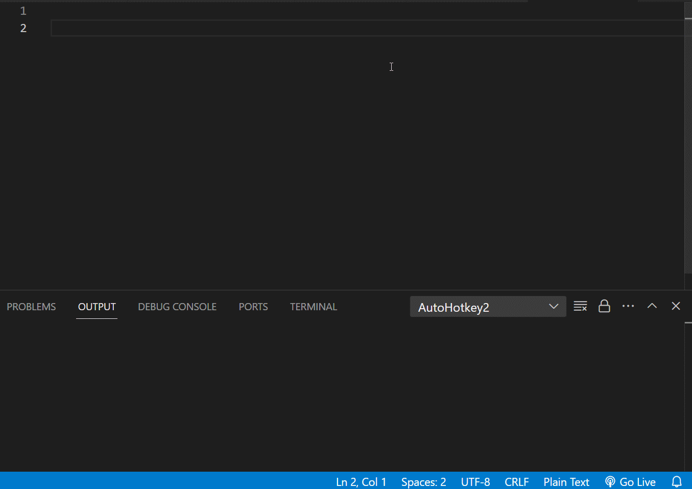
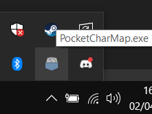

  <!--Logo design is my passion-->
  

A simple Windows' Character Map alternative, useful to quickly search unicode characters. Made with AutoHotkey V2.

### Demo

Click here to open the demo gif

  

### How to use
- Press `Win+,` anytime to open up the GUI.
- Type the name of the character you want to search (must match the name, or part of it).
- Press ENTER or click Search.
- Click the row of the character you want to copy, it will be automatically added to your clipboard.
- Enter empty field to restore the list.

### Donwload
#### Run the executable
- Go to the Release page and download the latest version.
- Extract the executable anywhere in your computer and double click it.
- Pressing `Win+,` should open the GUI. You can also verify if the script is running by looking for this icon in the taskbar:

  

If you want to stop the script, right click that icon and press Exit.

#### Compile from source
- Go to the [AutoHotkey download page](https://www.autohotkey.com/download/) and get V2 (this was developed with 2.0.3, newer versions _should_ work).
- Once you have AutoHotkey installed, execute `GenerateCharFile.ahk`. This will generate a text file `characters.txt`
- Use Ahk2Exe to compile `PocketCharMap.ahk` to an executable.

### Notes
- **The character names are in english only (for now)**. In a future version the user may choose to use english or the language Windows is set.
- If you want the executable to automatically run on startup: press `Win+R`, write `shell:startup` and put the executable there.
- The executable generates a text file `characters.txt` if it doesn't exist, which is used to fill the list quickly. That file must be in the same path as the executable.